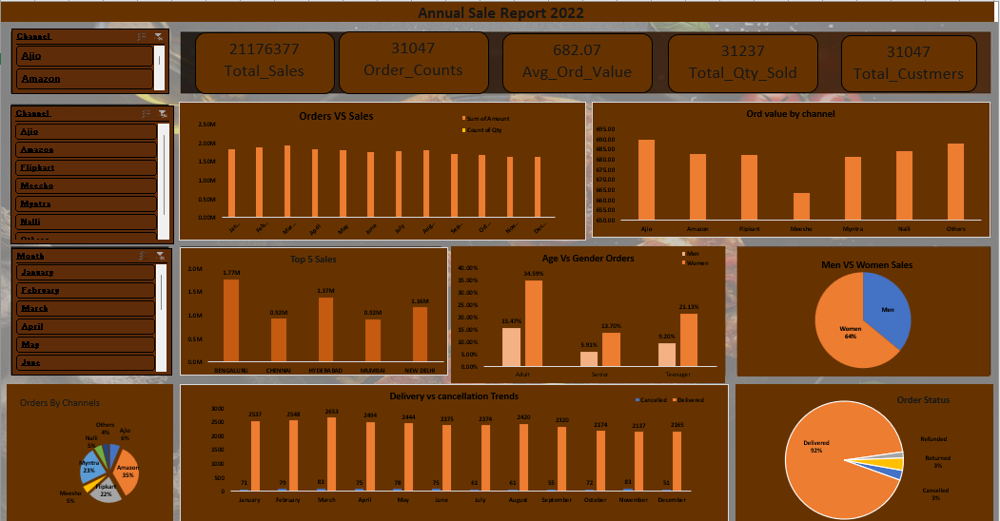

# 📊 Vrinda Store Sales Data Analysis (Excel Project)

## 📌 Project Overview
This project focuses on analyzing Vrinda Store sales data using Microsoft Excel.
The goal is to derive meaningful business insights and create an interactive dashboard.

---

## 🎯 Objectives
- Analyze overall sales performance
- Identify top products and categories
- Track monthly and yearly trends
- Understand customer buying patterns

---

## 🛠 Tools Used
- Microsoft Excel
- Pivot Tables
- Pivot Charts
- Slicers
- Data Cleaning & Formatting

---

## 📈 Dashboard Preview

---

## 📊 Analysis & Insights
- Women customers contribute more than men
- Highest sales from Maharashtra, Karnataka, and Uttar Pradesh
- Amazon and Flipkart generate maximum orders
- Most sales occur in the 30–49 age group

---

## 📂 Project Files
- 📄 Excel File: `Vrinda Store Data Analysis.xlsx`
- 📁 Images: `images/`
- 📁 Raw Data: `data/`

---

## ✅ Conclusion
This Excel dashboard helps stakeholders quickly understand sales trends
and make data-driven business decisions.

---

## 👩‍💻 Author
**Shruti Panigrahi**  
Aspiring Data Analyst  
